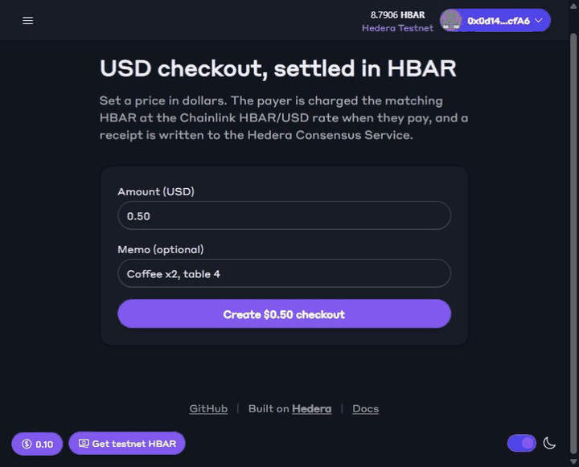
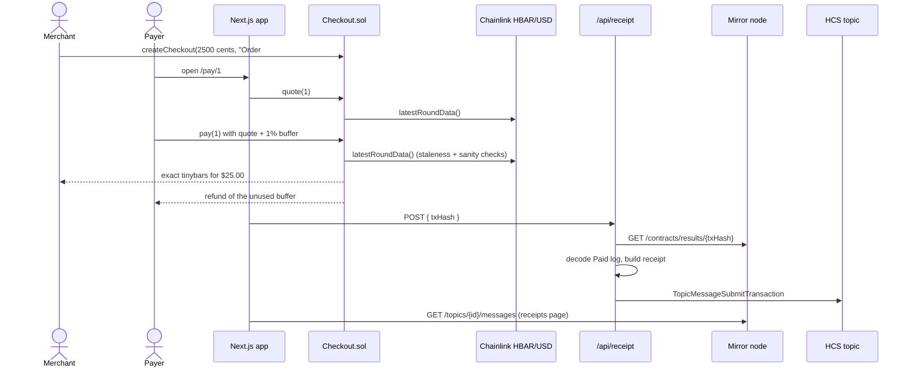

# hbar-usd-checkout

**Charge in dollars, settle in HBAR.** A [Scaffold-HBAR](https://github.com/hedera-dev/create-scaffold-hbar) template for USD-priced checkouts paid in HBAR. Each payment is priced on-chain by the **Chainlink HBAR/USD data feed**, and every paid checkout gets a tamper-evident receipt on the **Hedera Consensus Service**.

```bash
npx create-scaffold-hbar@latest --template Obiajulu-gif/hbar-usd-checkout
```

**Live demo:** [hbar-usd-checkout.vercel.app](https://hbar-usd-checkout.vercel.app) (Hedera testnet)



Almost every shop, SaaS plan, invoice or donation page needs a price in a fiat currency and settlement in the native token. Doing that correctly on Hedera means handling oracle staleness, decimal scaling, rounding, refunds, the tinybar/weibar split and an audit trail. This template ships all of it, tested and documented, so you can start from a working payment flow.

| | |
| --- | --- |
| **Hedera services** | Smart contract (`Checkout.sol`), Consensus Service (receipt topic), Mirror Node REST API (verification and history) |
| **Ecosystem integration** | Chainlink Data Feeds, HBAR/USD on Hedera testnet and mainnet |
| **Stack** | Next.js 15 (App Router), Hardhat, wagmi/viem, RainbowKit, `@hiero-ledger/sdk`, Yarn workspaces |

## Live on testnet

The scaffold points at this deployment, so the app works before you deploy anything.

| What | Link |
| --- | --- |
| Checkout contract | [0xEc49…853d](https://hashscan.io/testnet/contract/0xEc49609ACd45092802EB576DC9Fc7AFa6b13853d) |
| Example payment (`pay`) | [$0.25 paid with 2.382 HBAR](https://hashscan.io/testnet/transaction/0xd80c40405e5f171699d7eee1966b9928067b1eefa1efdcf49bcfff9ed8bc372d) |
| HCS receipt topic | [0.0.10805745](https://hashscan.io/testnet/topic/0.0.10805745) (receipt #1 is that payment) |
| Chainlink HBAR/USD feed (testnet) | [0x59bC…2B4a](https://hashscan.io/testnet/contract/0x59bC155EB6c6C415fE43255aF66EcF0523c92B4a) |

## How it works



1. **Create.** The merchant calls `createCheckout(usdCents, memo)`. Only the dollar amount is stored, so no HBAR price is locked in.
2. **Quote.** The pay page calls `quote(id)`, which converts cents to tinybars at the latest Chainlink price.
3. **Pay.** The payer sends the quote plus a 1% buffer. `pay(id)` reads the feed again **at execution time**, checks the answer is positive and fresh, computes the exact tinybars (rounded up for the merchant), pays the merchant and refunds the rest in the same transaction.
4. **Receipt.** The browser posts the tx hash to `/api/receipt`. The server fetches the transaction from the mirror node, checks it succeeded against this contract, decodes the `Paid` event and submits a JSON receipt to the HCS topic. The client only supplies a hash, so it cannot forge an amount.
5. **History.** `/receipts` reads the topic from the mirror node. HCS provides ordering, consensus timestamps and immutability, and the mirror node is the queryable index. HCS is not used as a database.

### Why an oracle is required

`Checkout` stores prices in USD and moves HBAR. Without the Chainlink feed there is no trustworthy on-chain rate, and an off-chain quote would let either side pick a favourable price. The contract checks the rate itself at the moment funds move.

### The price math

Chainlink returns HBAR/USD as `answer / 10^decimals` (8 decimals on Hedera). For `usdCents`:

```
tinybars = ceil( usdCents × 10^6 × 10^decimals / answer )
```

`10^6` is `1e8 tinybars per HBAR / 100 cents per dollar`. Rounding up means the merchant never receives less than the USD price. `requiredTinybars` is `public pure`, so you can call it from the Debug page.

### Units: tinybars vs weibars

This is the most common Hedera EVM bug, so it gets its own section.

| Where | Unit | 1 HBAR |
| --- | --- | --- |
| Inside Solidity (`msg.value`, `address.balance`) | tinybar | 10^8 |
| JSON-RPC, wagmi, viem, MetaMask (`tx.value`) | weibar | 10^18 |

The relay divides `tx.value` by 10^10 before execution, and anything smaller is dropped. `quote()` returns tinybars, and the pay page converts with `tinybarsToWeibars()` in [`utils/checkout/units.ts`](packages/nextjs/utils/checkout/units.ts). Never pass a tinybar amount to `parseEther`.

## Prerequisites

- **Node.js 20.18.3 or later** and **Git**
- **Yarn** via Corepack: `corepack enable`
- A browser wallet that supports Hedera testnet (MetaMask, HashPack or the built-in burner wallet)
- A **Hedera testnet ECDSA account** with testnet HBAR from the [Hedera Portal faucet](https://portal.hedera.com/faucet). It is only needed to write HCS receipts or deploy your own contract.

## Quickstart

### 1. Scaffold and run

```bash
npx create-scaffold-hbar@latest --template Obiajulu-gif/hbar-usd-checkout my-checkout
cd my-checkout
yarn next:dev
```

Open http://localhost:3000, connect a wallet on **Hedera Testnet**, and create a checkout. It runs against the live testnet contract above. Open the `/pay/<id>` link in another browser or with another account and pay it.

Payments work at this point. Receipts need step 2.

### 2. Turn on HCS receipts

```bash
cp packages/nextjs/.env.example packages/nextjs/.env.local
```

Fill in your testnet account:

```bash
HEDERA_OPERATOR_ID=0.0.1234567
HEDERA_OPERATOR_KEY=0x...   # hex ECDSA or DER (302...) from portal.hedera.com
```

Create your receipt topic. Only your operator key can submit to it:

```bash
yarn hcs:create-topic
# Topic created: 0.0.7654321
```

Add the topic to `packages/nextjs/.env.local`, then restart `yarn next:dev`:

```bash
NEXT_PUBLIC_HCS_TOPIC_ID=0.0.7654321
```

Pay a checkout. The pay page links the receipt and `/receipts` lists it.

### 3. Deploy your own Checkout (optional)

```bash
yarn hardhat:account:import      # paste your ECDSA key, choose a password (stored encrypted)
yarn hardhat:deploy --network hederaTestnet
```

The deploy writes the new address and ABI to `packages/nextjs/contracts/deployedContracts.ts`, and the frontend switches over automatically. Check the live deployment end to end ($0.25 checkout: create, quote, pay, with HashScan links):

```bash
yarn hardhat:smoke --network hederaTestnet
```
 Verify the source on Sourcify (shown on HashScan) with `yarn hardhat:verify:testnet`.

### 4. Deploy the frontend to Vercel (optional)

Import the repo in Vercel and set **Root Directory** to `packages/nextjs`. Add the environment variables from the table below. Set `HEDERA_OPERATOR_KEY` as a **Sensitive** variable, and set `YARN_ENABLE_IMMUTABLE_INSTALLS=false` so Vercel's Yarn install accepts the workspace lockfile. Without the operator key the deployed app still takes payments; only HCS receipts are skipped.

## Environment variables

`packages/nextjs/.env.local`

| Variable | Required | Description |
| --- | --- | --- |
| `HEDERA_OPERATOR_ID` | For receipts | Testnet account (`0.0.x`) that pays for HCS submissions. Server-only. |
| `HEDERA_OPERATOR_KEY` | For receipts | Its private key, hex ECDSA or DER. Server-only, never `NEXT_PUBLIC_`. |
| `NEXT_PUBLIC_HCS_TOPIC_ID` | For receipts | Receipt topic from `yarn hcs:create-topic`. |
| `NEXT_PUBLIC_MIRROR_NODE_URL` | No | Defaults to `https://testnet.mirrornode.hedera.com`. |
| `NEXT_PUBLIC_HEDERA_TESTNET_RPC_URL` | No | Defaults to `https://testnet.hashio.io/api`. |
| `NEXT_PUBLIC_WALLET_CONNECT_PROJECT_ID` | No | Your WalletConnect project id for production. |

`packages/hardhat/.env`

| Variable | Required | Description |
| --- | --- | --- |
| `DEPLOYER_PRIVATE_KEY_ENCRYPTED` | For deploys | Written by `yarn hardhat:account:import` / `account:generate`. Do not edit. |
| `HBAR_USD_FEED` | No | Override the Chainlink feed address. Defaults per network in `deploy/00_deploy_checkout.ts`. |
| `MAX_PRICE_AGE_SEC` | No | Reject prices older than this. Default `3600`. |

Without any `.env` the app still builds and runs: payments use the live contract, and the receipt pages explain what to configure.

## Project structure

```
packages/
├── hardhat/
│   ├── contracts/
│   │   ├── Checkout.sol                    # checkout state, oracle pricing, settlement
│   │   ├── interfaces/AggregatorV3Interface.sol
│   │   └── mocks/MockAggregator.sol        # tests only
│   ├── deploy/00_deploy_checkout.ts        # Chainlink feed per network
│   └── test/Checkout.test.ts
└── nextjs/
    ├── app/
    │   ├── page.tsx                        # merchant: create checkout
    │   ├── pay/[id]/page.tsx               # payer: quote + pay + receipt
    │   ├── receipts/page.tsx               # HCS receipt feed
    │   └── api/
    │       ├── receipt/route.ts            # mirror-node verification → HCS submit
    │       └── health/route.ts
    ├── utils/checkout/
    │   ├── units.ts                        # tinybar/weibar, USD parsing, slippage buffer
    │   ├── receipt.ts                      # receipt schema, Paid-log decoding
    │   ├── mirror.ts                       # mirror node client with lag retries
    │   └── hcs.ts                          # operator client, topic submit (server only)
    └── scripts/createTopic.mjs
```

The rest (`/debug`, `/blockexplorer`, wallet wiring, scaffold hooks) is standard Scaffold-HBAR.

## Testing

```bash
yarn hardhat:test   # contract: pay, refund, price moves, stale/zero price, double pay, math, rounding
yarn next:test      # frontend: unit conversion, USD parsing, receipt decoding and validation
```

Contract tests run on an in-memory Hardhat chain with `MockAggregator`, so they need no network or keys.

## Security notes

- **Oracle checks.** Answers must be positive and no older than `maxPriceAgeSec` (default 1 hour; the testnet feed updates every 10–30 minutes). Tighten this for volatile periods or high-value checkouts.
- **Reentrancy.** `pay` marks the checkout paid and emits before transferring HBAR (checks-effects-interactions). A second `pay` on the same id reverts with `AlreadyPaid`.
- **Receipt integrity.** `/api/receipt` takes only a hash and rebuilds the receipt from the mirror node, and the topic's submit key restricts writes to your operator. The endpoint deduplicates by tx hash. Behind several server instances, move dedupe to a database unique index (see the `ponytail:` note in the route).
- **No admin keys.** The contract has no owner, pause or upgrade path. Fork it if your business needs refunds, expiry or cancellation.

## Extending

- **Mainnet.** Deploy with `--network hederaMainnet` (the mainnet Chainlink feed is preconfigured), switch `Client.forTestnet()` in `utils/checkout/hcs.ts` and the mirror node URL, and create a mainnet topic.
- **HTS stablecoin payments.** Add a `payWithToken` path through the HTS precompile at `0x167`.
- **Subscriptions.** Pair `createCheckout` with the Hedera Schedule Service to bill on a schedule.
- **Other currencies.** Use any Chainlink `HBAR/<fiat>` feed. The contract only depends on `decimals()`.

## Troubleshooting

| Symptom | Fix |
| --- | --- |
| "No fresh HBAR/USD price" on the pay page | The feed has not updated within `maxPriceAgeSec`. Wait for the next round or redeploy with a larger `MAX_PRICE_AGE_SEC`. |
| `Underpaid` revert | The price moved more than the 1% buffer between quote and execution. Retry. |
| "Gas price below configured minimum" | Hashio reports a placeholder block base fee. `scaffold.config.ts` overrides fee estimation with `eth_gasPrice` for Hedera chains; keep that override if you replace the chain config. |
| Wallet shows a tiny amount or 0 | A tinybar value was sent as weibars. Use `tinybarsToWeibars()`. |
| "HCS receipts are not configured" (503) | Set the three receipt variables in `packages/nextjs/.env.local` and restart the dev server. |
| "Transaction not found on the mirror node yet" | The mirror node lags consensus by a few seconds. Use the Retry button. |
| `INVALID_SIGNATURE` when creating a topic | The key does not match `HEDERA_OPERATOR_ID`, or it is ED25519 while the code expects ECDSA. Use the key shown for that account in the Portal. |

## License

MIT. See [LICENCE](LICENCE).
